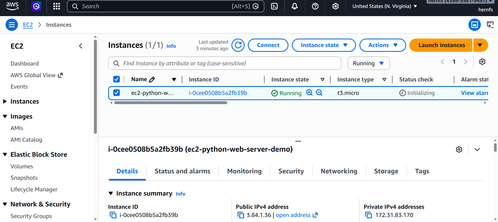
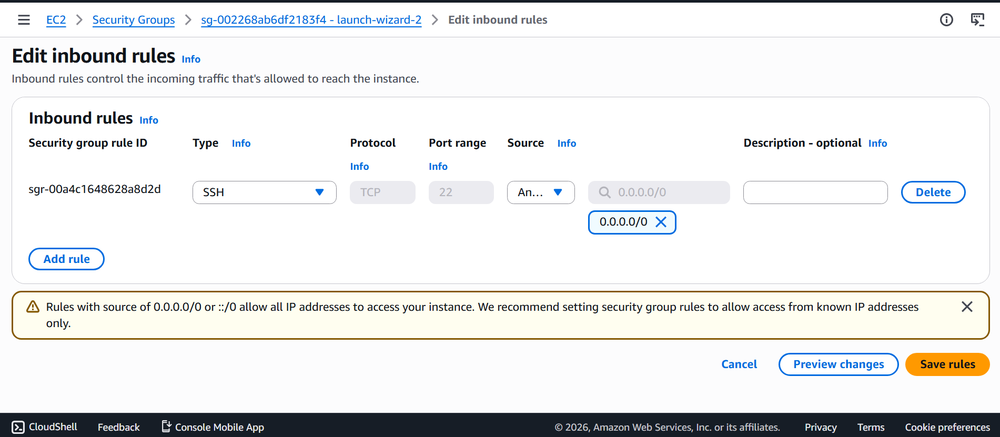
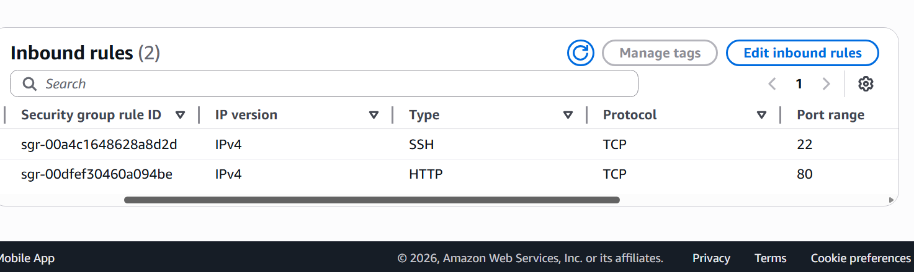
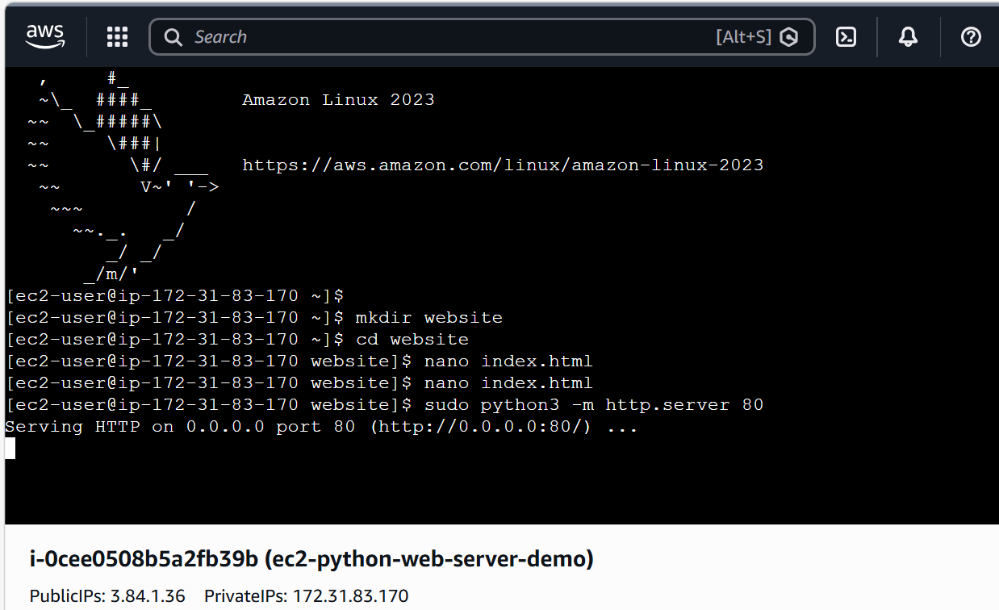

# aws-ec2-python-web-server
## EC2 Instance Running

I launched an EC2 instance using Amazon Linux and verified that it is in a running state.


## Initial Security Configuration

Initially, the security group only allowed SSH (port 22) access, which is used to connect to the EC2 instance.



## Identifying Missing HTTP Access

I noticed that HTTP (port 80) was not enabled, which would prevent external users from accessing the web server through a browser.

To resolve this, I added an inbound rule to allow HTTP traffic on port 80.
## Updated Security Configuration

After adding the HTTP rule on port 80, the EC2 instance was able to receive web traffic from the internet.


## Project Overview

In this project, I launched an Amazon EC2 instance, connected to it through the terminal, created a simple HTML webpage, and hosted it using Python’s built-in web server.

## Terminal Setup and Commands

After connecting to my EC2 instance through the browser-based terminal, I began setting up my project environment. I first ran the command `mkdir website`, which created a new directory named `website` to keep my files organized. I then used `cd website` to navigate into that directory so that any files I created would be stored in the correct location.

Next, I ran `nano index.html`, which opened the Nano text editor and allowed me to create and edit a file named `index.html`. This file is important because it serves as the main webpage that the server will display.

The screenshot below shows the sequence of commands I executed in the terminal.


## Creating the HTML File

```bash
nano index.html
```

I created this file to serve as the main webpage content. The `index.html` file is the default file a web server loads, allowing the EC2 instance to display the website in the browser.


